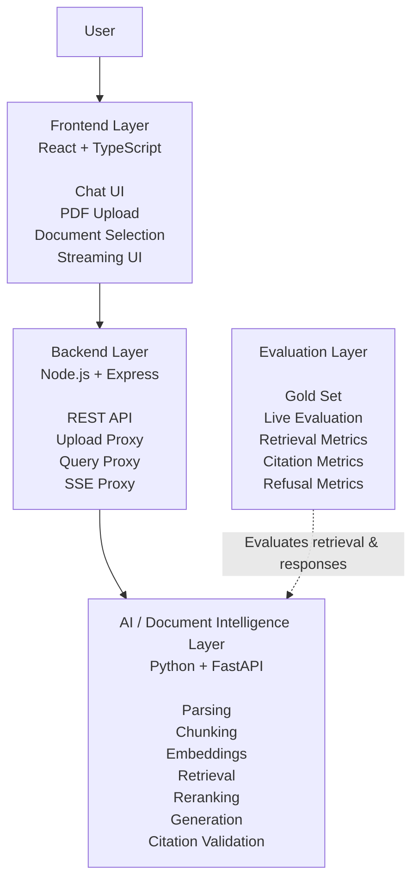
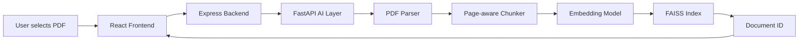
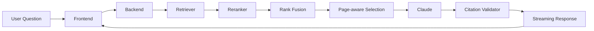
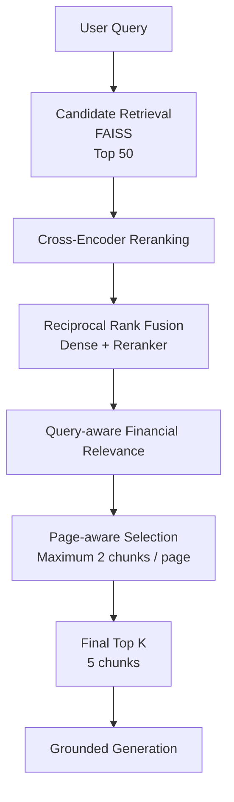
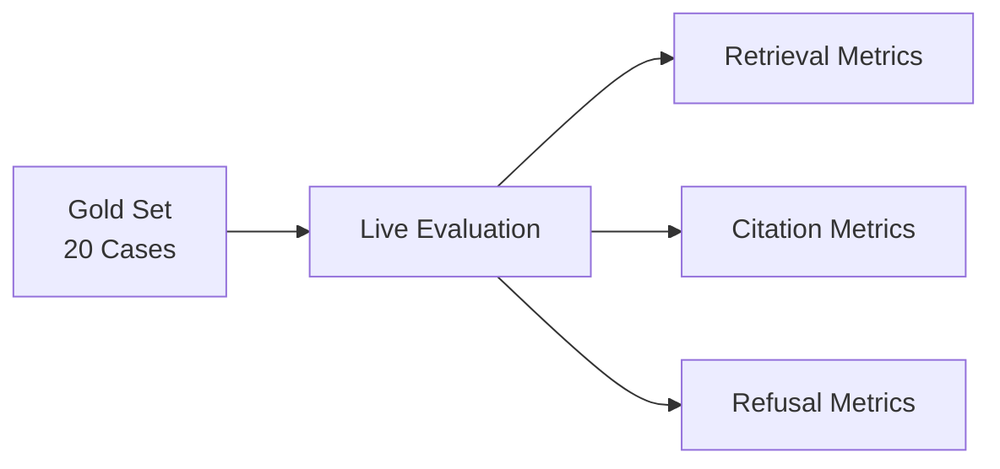
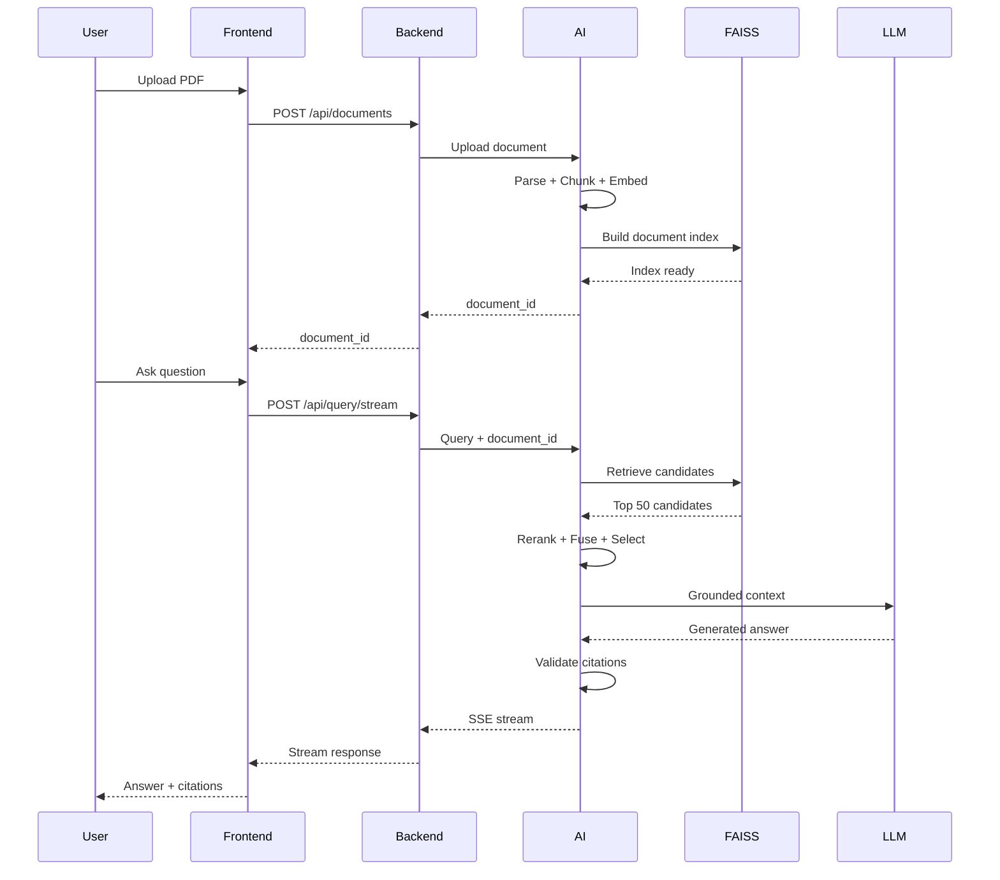

# Nimbus — Document Intelligence Assistant

> A full-stack RAG application for asking grounded questions over PDF documents with page-level citations, retrieval evaluation, refusal handling, and real-time streaming responses.

---

## Overview

**Nimbus** is a document intelligence assistant that lets users upload PDF documents and ask questions about their contents.

Nimbus follows a retrieval-first RAG architecture:

```text
PDF
 ↓
Parse
 ↓
Page-aware Chunking
 ↓
Embeddings
 ↓
FAISS Retrieval
 ↓
Cross-Encoder Reranking
 ↓
Rank Fusion
 ↓
Page-aware Selection
 ↓
Grounded LLM Response
 ↓
Citation Validation
```

The system is designed to keep generated answers grounded in retrieved document evidence and provide page-level citations such as:

```text
[Page 36]
```

---

# Architecture

Nimbus is organized into three production layers with a separate evaluation system.



### Layer Responsibilities

| Layer | Technology | Responsibility |
|---|---|---|
| Frontend | React + TypeScript | Chat interface, PDF upload, document selection, streaming responses |
| Backend | Node.js + Express | API gateway between frontend and AI layer |
| AI Layer | Python + FastAPI | Document processing, retrieval, reranking, generation and citation validation |
| Evaluation | Python | Retrieval, citation and refusal evaluation |

---

# End-to-End Workflow

## Document Upload Flow



### What happens

1. The user uploads a PDF through Nimbus.
2. The frontend sends the file to the backend.
3. The backend forwards the document to the AI layer.
4. The PDF is parsed while preserving page information.
5. Text is divided into page-aware fixed-size chunks.
6. Each chunk is converted into an embedding.
7. Embeddings are stored in a document-specific FAISS index.
8. A `document_id` is returned to the frontend.
9. The document becomes available for querying.

---

## Question Answering Flow



The user question passes through the retrieval pipeline before the LLM generates an answer.

---

# Retrieval Engine

Nimbus uses a multi-stage retrieval architecture.



### Retrieval stages

| Stage | Purpose |
|---|---|
| FAISS Retrieval | Retrieves the initial semantic candidate pool |
| Cross-Encoder | Re-evaluates query-document relevance |
| Reciprocal Rank Fusion | Combines rankings from multiple retrieval signals |
| Financial Relevance | Gives additional weight to financial terminology, metrics and requested years |
| Page-aware Selection | Prevents excessive concentration on the same page |
| Final Top-K | Produces the evidence supplied to generation |

### Current Retrieval Configuration

| Component | Configuration |
|---|---|
| Candidate pool | 50 chunks |
| Final retrieval | 5 chunks |
| Embeddings | `sentence-transformers/all-MiniLM-L6-v2` |
| Vector store | FAISS |
| Reranker | `cross-encoder/ms-marco-MiniLM-L-6-v2` |
| RRF | Dense + reranker |
| RRF `k` | 60 |
| Maximum chunks per page | 2 |
| Chunk size | 512 tokens |
| Chunk overlap | 50 tokens |

> **Current chunking strategy:** page-aware fixed-size token chunking with 512-token chunks and 50-token overlap. Semantic chunking is a planned enhancement, not the current implementation.

---

# Grounded Generation

After retrieval, Nimbus constructs a context containing the selected document evidence and sends it to the LLM.

The generation stage follows three principles:

### Grounded Answers

The model receives retrieved document evidence instead of relying only on internal knowledge.

### Page-level Citations

Responses are expected to reference supporting pages:

```text
[Page 36]
```

### Citation Validation

Generated citations are validated against the pages actually retrieved by the system.

If generated citations cannot be verified, the response is rejected rather than presented as a trusted answer.

---

# Runtime Experience

Nimbus provides a ChatGPT-style document interaction experience.


### Runtime Features

- PDF upload through the chat interface
- Multiple uploaded documents displayed in the document shelf
- Active document selection
- Document-specific querying
- Streaming responses using SSE
- Page-level citations
- Grounded answers
- Refusal for unsupported questions
- Runtime document ingestion

> Multiple PDFs can be uploaded and selected in the interface. The current query pipeline operates against the **active selected document**, rather than performing simultaneous multi-document retrieval.

---

# Technology Stack

## Frontend

| Technology | Purpose |
|---|---|
| React | User interface |
| TypeScript | Type-safe frontend development |
| Vite | Frontend development and build tooling |
| CSS | Nimbus UI and responsive layout |
| SSE | Real-time streamed responses |

## Backend

| Technology | Purpose |
|---|---|
| Node.js | Backend runtime |
| Express | REST API layer |
| HTTP | Communication with the AI service |
| SSE | Streaming proxy |

## AI / Document Intelligence

| Technology | Purpose |
|---|---|
| Python | AI processing |
| FastAPI | AI service API |
| PDF Parser | Document extraction |
| Sentence Transformers | Text embeddings |
| FAISS | Vector similarity search |
| Cross-Encoder | Relevance reranking |
| Claude | Grounded answer generation |

## Evaluation

| Component | Purpose |
|---|---|
| Gold Set | Defines expected answers/pages |
| Live Evaluation | Tests the integrated retrieval pipeline |
| Retrieval Metrics | Measures evidence retrieval |
| Citation Metrics | Measures citation quality |
| Refusal Metrics | Measures unsupported-query handling |

---

# API

## Backend API

| Method | Endpoint | Purpose |
|---|---|---|
| `GET` | `/api/health` | Backend health check |
| `POST` | `/api/documents` | Upload a PDF |
| `POST` | `/api/query` | Ask a question |
| `POST` | `/api/query/stream` | Stream an answer |

## AI Layer API

| Method | Endpoint | Purpose |
|---|---|---|
| `GET` | `/health` | AI service health check |
| `GET` | `/` | Service information |
| `POST` | `/documents/upload` | Process a document |
| `POST` | `/query` | Generate an answer |
| `POST` | `/query/stream` | Stream an answer |

---

# Evaluation

Evaluation is maintained separately from the production request path.



## Latest Evaluation Results

Produced by `python -m evaluation.run_evaluation` against the unchanged production
pipeline, over a 24-case gold set: 18 answerable, 6 unanswerable.

### Answer quality — what the user actually gets

| Metric | Result |
|---|---:|
| Answer Accuracy | **0.830** |
| Numeric Grounding | **1.000** |
| Answer Rate | **1.000** (18 / 18) |
| Correct Refusal Rate | **1.000** (6 / 6) |

### Retrieval diagnostics — debugging aids, not targets

| Metric | Result |
|---|---:|
| Page Recall | **87.0%** |
| Page Precision (adjusted) | **48.6%** |
| Citation Recall | **81.5%** |

### Retired — cannot be improved by retrieval

| Metric | Result | Why retired |
|---|---:|---|
| Page Precision (raw) | 22.8% | ceiling is 27.3% |
| Exact Page Match | 0.0% | maximum achievable is 5.6% |
| Citation Precision | 100% | enforced by the pipeline, so it can never report a problem |

### A note on the numbers this README used to report

Earlier versions of this file reported **94.1% Page Recall** and **88.2% Citation
Recall**, and described an improvement from a 71.6% baseline. Those figures were
measured against the first version of the gold set, which was subsequently found to
contain three mislabelled cases and nine under-labelled ones, with 41% of answerable
cases pointing at a single page of financial tables.

The gold set was rebuilt with two-tier labelling (`primary_pages` / `acceptable_pages`),
verified page by page against the extracted text. Every figure above comes from that
corrected set and is reproducible with one command. The retrieval-improvement story is
real, but it cannot be quantified against a ruler that was itself wrong.

---

# What the Evaluation Measures

| Metric | Meaning |
|---|---|
| Answer Accuracy | How much of the verified answer the system actually produced |
| Numeric Grounding | Whether every figure in an answer traces to retrieved text |
| Answer Rate | Whether answerable questions were answered rather than refused |
| Page Recall | Whether pages required by the gold set were retrieved |
| Page Precision | How much of the retrieved page set is relevant |
| Exact Page Match | Whether the retrieved page set exactly matches the expected set |
| Citation Precision | Whether cited pages are supported by retrieved evidence |
| Citation Recall | Whether expected evidence pages appear in generated citations |
| Correct Refusal Rate | Whether unsupported questions are correctly refused |

---

# Engineering Challenges

| Challenge | Engineering Response |
|---|---|
| Important financial pages were sometimes missed | Added query-aware financial relevance signals and refined ranking |
| Multiple relevant chunks came from the same page | Added page-aware selection with a maximum of two chunks per page |
| Initial retrieval contained noisy candidates | Introduced cross-encoder reranking |
| LLM could produce unverifiable citations | Added citation validation against retrieved pages |
| Unsupported questions needed controlled behaviour | Added refusal handling |
| Runtime PDFs needed isolated retrieval | Created document-specific indexes |
| Long-running answers needed better UX | Added SSE streaming |

---

# Project Structure

```text
document-intelligence-assistant/
│
├── ai-layer/
│   ├── app/
│   │   ├── api/
│   │   ├── services/
│   │   ├── config.py
│   │   └── ...
│   │
│   ├── data/
│   │   ├── uploads/
│   │   └── indexes/
│   │
│   └── main.py
│
├── backend/
│   ├── controllers/
│   ├── routes/
│   ├── services/
│   ├── middleware/
│   └── ...
│
├── frontend-layer/
│   ├── src/
│   │   ├── App.tsx
│   │   ├── App.css
│   │   └── ...
│   └── package.json
│
├── evaluation/
│   ├── gold_set.json
│   ├── metrics.py
│   ├── evaluator.py
│   ├── run_evaluation.py
│   └── ...
│
├── data/
│
├── .gitignore
└── README.md
```

---

# Running Nimbus Locally

## 1. Clone the Repository

```bash
git clone https://github.com/sujayyy/nimbus-document-intelligence-assistant.git
cd nimbus-document-intelligence-assistant
```

## 2. Configure the AI Layer

Create:

```text
ai-layer/.env
```

Add your own API key:

```env
ANTHROPIC_API_KEY=
```

Do not commit `.env`.

The repository intentionally contains only an empty environment-variable placeholder.

## 3. Start the AI Layer

```bash
cd ai-layer
```

Install the Python dependencies used by the project and start FastAPI on port `3000`.

Example:

```bash
uvicorn main:app --reload --port 3000
```

Health check:

```text
GET http://localhost:3000/health
```

## 4. Start the Backend

Open another terminal:

```bash
cd backend
```

Install the Node.js dependencies and start the Express backend using the project's configured start command.

The backend runs on:

```text
http://localhost:5001
```

Health check:

```text
GET http://localhost:5001/api/health
```

## 5. Start the Frontend

Open another terminal:

```bash
cd frontend-layer
npm install
npm run dev
```

Vite will provide the local frontend URL.

---

# Runtime Request Flow



---

# Security & Repository Hygiene

The repository is configured to avoid committing runtime and secret data.

Ignored items include:

```text
.env
.env.*
__pycache__/
.venv/
node_modules/
ai-layer/data/uploads/
ai-layer/data/indexes/
evaluation/live_results.json
evaluation/evaluation_results.json
```

API credentials should always remain in local environment configuration.

Runtime PDFs and generated FAISS indexes are intentionally excluded from version control.

---

# Current Limitations

Nimbus is an actively developed engineering project. Current limitations include:

- Fixed-size chunking rather than semantic chunking
- One active document is queried at a time
- Page precision remains lower than page recall
- Exact page-set matching is currently `0%`
- Table and complex document-layout understanding can be improved
- Authentication and multi-user document isolation are not yet implemented

These limitations are explicitly separated from current implemented functionality.

---

# Future Enhancements

## 1. Semantic / Structure-aware Chunking

Move beyond fixed-size token windows by using document structure, headings, sections and semantic boundaries.

## 2. Multi-document Workspaces

Allow users to query, compare and reason across multiple uploaded documents simultaneously.

## 3. Table and Layout-aware Retrieval

Improve handling of:

- financial tables
- charts
- multi-column layouts
- structured reports
- captions and figures

## 4. Document Lifecycle & Security

Add:

- authentication
- user-specific workspaces
- document permissions
- document deletion
- versioning
- persistent metadata
- stronger isolation between users

---

# Key Engineering Takeaways

### Retrieval

A useful RAG system requires more than simply embedding documents and performing vector search.

### Reranking

A second-stage relevance model can improve the ordering of retrieved evidence.

### Evidence Control

Page-aware selection helps control how evidence is distributed across the final context.

### Grounding

The generation layer operates on retrieved evidence rather than unrestricted document-independent generation.

### Citation Validation

Generated citations need to be checked against the evidence actually retrieved.

### Evaluation

A RAG system should be measured independently using retrieval, citation and refusal metrics rather than relying only on subjective answer quality.

---

# Project Focus

Nimbus explores the engineering challenges involved in creating a document-grounded AI assistant from ingestion through evaluation.

The project combines:

```text
Frontend Engineering
        +
Backend API Design
        +
Document Processing
        +
Vector Retrieval
        +
Reranking
        +
LLM Generation
        +
Citation Validation
        +
Evaluation
```

into a single end-to-end system.

---

## License

This project is intended for educational, portfolio and engineering demonstration purposes.
